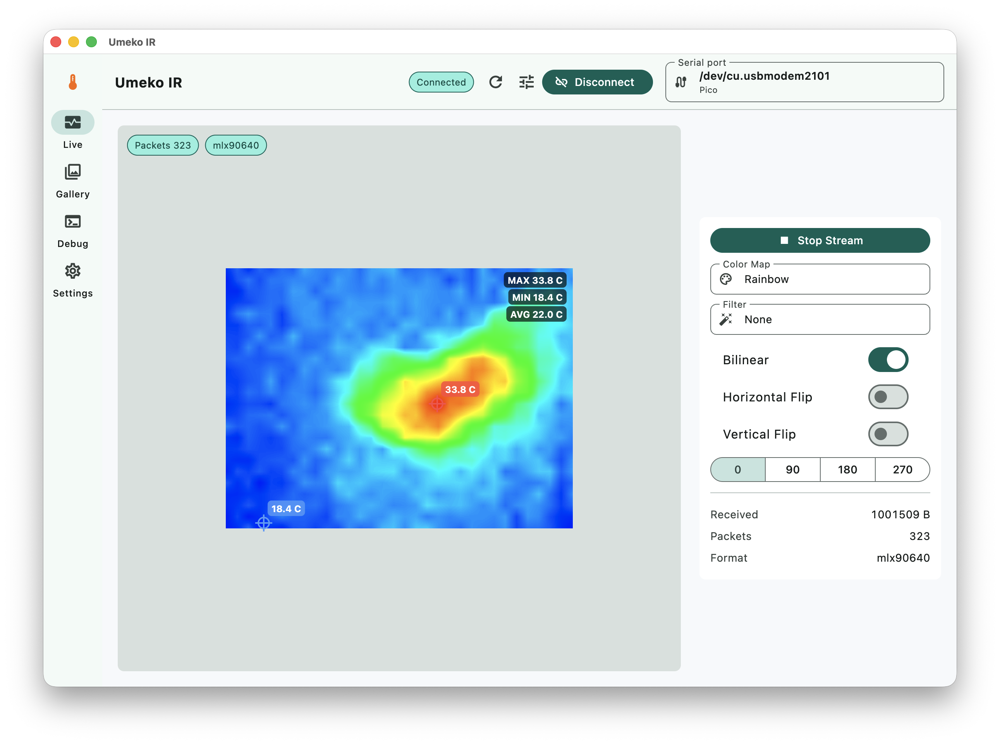
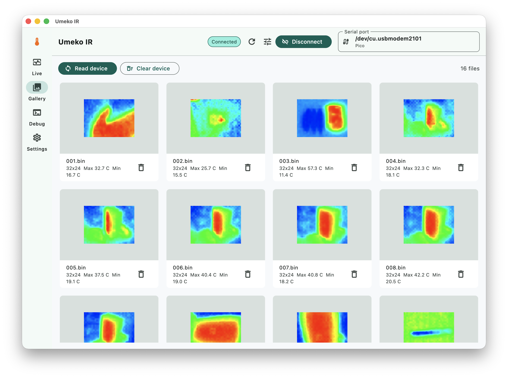
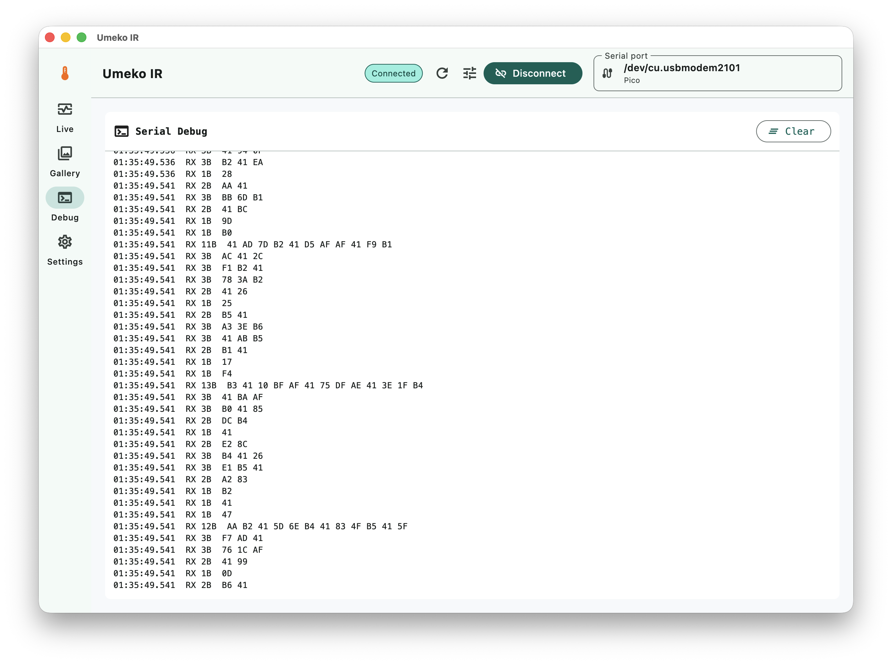

# Umeko IR

[English](README.md)

Umeko IR 是一个面向 Umeko IR 设备的跨平台热成像控制台。它可以通过串口或 USB 连接设备，实时渲染热成像画面，读取设备中保存的热图文件，并提供原始串口 HEX 调试输出，方便固件调试和日常使用。

这个 App 适用于 [umeiko/RP2040-MLX90640-touchscreen-arduino](https://github.com/umeiko/RP2040-MLX90640-touchscreen-arduino) 项目的硬件设备。



## 功能

- 实时热成像串流，显示数据包数量和识别到的传感器格式。
- 显示最高温、最低温、平均温度。
- 自动标注最高温和最低温锚点。
- Live 和 Gallery 预览复用同一套配色、滤镜和渲染控制。
- 支持双线性放大、水平翻转、垂直翻转和旋转。
- 读取设备中保存的 `.bin` 热图文件。
- Gallery 支持边读取边追加显示，并显示读取进度。
- 支持删除单张设备图片，以及二次确认后清空设备图片。
- 串口调试页显示自动轮转的 HEX 原始数据。
- 支持浅色、深色、跟随系统主题。
- 内置英语、中文、日语界面。

## 截图

### 实时画面


### 设备图库



### 串口调试



## 支持的数据格式

- MLX90640 `MLX40BEGIN` / `MLX40END` float 帧，32x24。
- MLX90641 `MLX41BEGIN` / `MLX41END` float 帧，16x12。
- Heimann `BEGIN` / `END` uint16 Kelvin 帧，32x32。
- Legacy `BEGIN` / `END` float 帧，32x24。
- 设备图库命令：`ls`、`cat /<file>.bin`、`rm /<file>.bin`、`clear_photos`。

## 平台支持

- macOS、Windows、Linux：通过 `flutter_libserialport` 访问串口。
- Android：通过 `usb_serial` 访问 USB 串口设备。
- Web：保留独立的 Web Serial 适配边界，实际硬件访问取决于浏览器 Web Serial 支持情况。

## 使用方式

1. 通过 USB 连接 Umeko IR 设备。
2. 打开 Umeko IR。
3. 如果没有自动选择串口，手动选择设备串口。
4. 点击 **连接**。
5. 点击 **开始串流** 查看实时热成像画面。
6. 使用 **配色**、**滤镜**、**双线性**、翻转和旋转控制调整图像显示。
7. 打开 **图库**，点击 **读取设备** 读取设备中的 `.bin` 文件。
8. 打开 **调试** 查看原始串口 HEX 数据。

默认比特率是 `115200`。断开连接后可以在设备设置中切换比特率。

## 开发

```bash
cd src
flutter pub get
dart format .
flutter analyze
flutter test
```

启动 macOS 客户端：

```bash
cd src
flutter run -d macos
```

构建示例：

```bash
cd src
flutter build macos --release
flutter build apk --release
flutter build web --release
```

## 应用图标

Logo 源文件位于 `assets/logo/raw.png`。平台图标通过 `src/pubspec.yaml` 中的 `flutter_launcher_icons` 配置生成：

```bash
cd src
flutter pub run flutter_launcher_icons
```

## 说明

- macOS 串口访问需要在本地测试和正式分发时正确配置 App Sandbox。
- Android 打开 USB 串口设备时，系统会弹出 USB 权限请求。
- 构建缓存、本地 SDK 元数据、Pods、Gradle 状态和签名文件都已通过 `.gitignore` 忽略。

## 许可证

本项目使用 [MIT License](LICENSE)。
